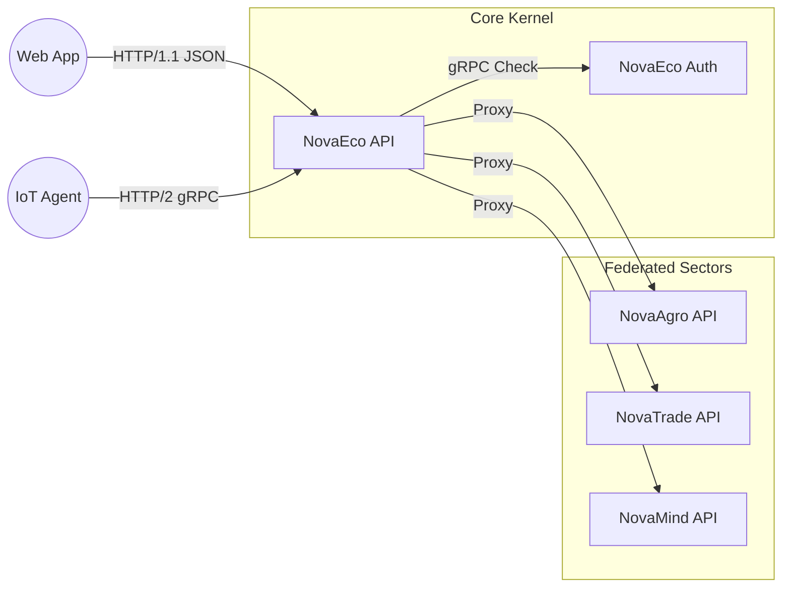

# ⛩️ NovaEco API Gateway

> **The Front Door of the NovaEco.**
> A unified, multiplexed interface that routes public traffic to internal microservices (Enablers & Sectors).

## 📖 Overview

The **NovaEco API Gateway** is the single entry point for all external clients (Web Dashboards, Mobile Apps, IoT Devices). It acts as a **Hybrid Server**, enforcing security and handling routing for both standard web traffic and high-performance agents.

* **Role:** Reverse Proxy, Orchestrator, and Health Aggregator.
* **Protocol:** Multiplexed HTTP/1.1 (REST) & HTTP/2 (gRPC).
* **Ports:**
    * `8000`: Public HTTP Ingress (REST / Proxy).
    * `50051`: Internal Management Interface (gRPC).
* **Auth:** Validates Bearer Tokens via `novaeco-auth` before routing.

---

## 🏗️ Architecture

The Gateway implements a **"Contract-First"** design. It exposes a stable surface while delegating logic to the federated ecosystem.



## 📜 Contracts & Specifications

This service is strictly defined by its schema files. These are the **Sources of Truth** for all behavior.

| Interface | File | Description |
| --- | --- | --- |
| **REST API** | `api/openapi.yaml` | Defines public management endpoints (`/health`, `/`) and error formats. |
| **gRPC API** | `api/proto/v1/api.proto` | Defines binary management endpoints (`GetHealth`, `GetInfo`) for internal agents. |

## 🚀 Development

### Running Locally

This service runs inside the **Core DevContainer**.

```bash
# Start the Hybrid Server (Flask + gRPC)
python -m src.api_service
```

* **Health Check:** http://localhost:8000/health
* **OpenAPI Specs:** Located in `api/openapi.yaml`

### Testing

We use a **V-Model** testing strategy:

1. **Unit (L5):** Verify routing logic and proxy overhead.
```bash
pytest tests/unit
```


2. **Contract (L4):** Verify implementation matches `openapi.yaml`.
```bash
pytest tests/integration/contracts
```


3. **Performance:** Measure proxy latency (< 20ms).
```bash
pytest tests/performance
```